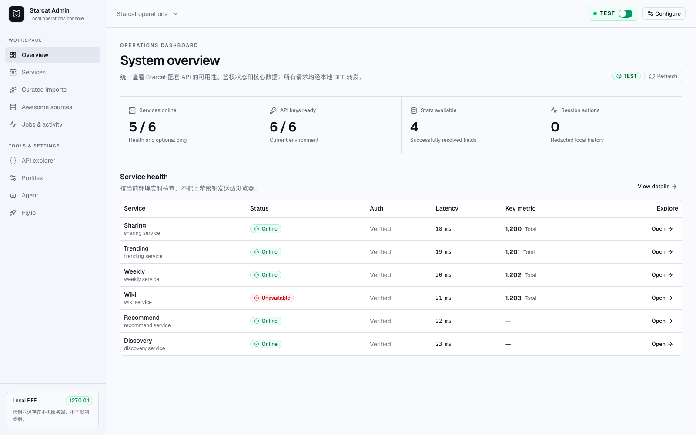

# Starcat Admin Console

<!-- starcat-promo:start -->
<div align="center">
<a href="https://starcat.ink"></a>

<p><strong>Local-first operations console for Starcat services, data workflows, curated publishing, and Awesome source management.</strong></p>
<p>Starcat is a native macOS app that turns GitHub Stars into a searchable, organized and AI-assisted local knowledge base. Version 1.4.0 includes README rendering, knowledge-base RAG, GitHub notifications, My Projects, library and repository insights, macOS desktop widgets, tags and private notes, release tracking, repository health signals, AI summaries, semantic search, browser plugins, Alfred / uTools / Raycast search integrations, and self-hostable support APIs.</p>

<a href="https://github.com/starcat-app/homebrew-starcat"></a>
<br/>
<sub><a href="./README-ZH.md">中文说明</a></sub>
</div>

<div align="center">
<a href="https://starcat.ink"></a>
<a href="https://github.com/starcat-app/starcat-pro"></a>
<a href="https://github.com/starcat-app/homebrew-starcat"></a>
<a href="https://github.com/starcat-app/starcat-localization"></a>
</div>

<div align="center">

</div>

**Preferred install method:**

```bash
brew tap starcat-app/starcat
brew trust starcat-app/starcat
brew install --cask starcat
```

**Useful links:**

- Home and downloads: https://starcat.ink
- Mac App Store: search for Starcat for GitHub
- Current Direct build: https://starcat.ink/downloads/Starcat-1.4.0-arm64.dmg
- Public support and release notes: https://github.com/starcat-app/starcat-pro
- Starcat App Homebrew tap: https://github.com/starcat-app/homebrew-starcat
- CLI / MCP: [starcat-cli](https://github.com/starcat-app/starcat-cli) / [Homebrew tap](https://github.com/starcat-app/homebrew-starcat-cli)
- AI Agent Skill: https://github.com/starcat-app/starcat-skill
- Browser plugins: [Chrome](https://github.com/starcat-app/starcat-chrome-plugin) / [Safari](https://github.com/starcat-app/starcat-safari-plugin)
- Launcher integrations: [Alfred](https://github.com/starcat-app/starcat-alfred-workflow) / [uTools](https://github.com/starcat-app/starcat-utools-plugin) / [Raycast](https://github.com/starcat-app/starcat-raycast-extension)
- Documentation: https://github.com/starcat-app/starcat-docs
- Website source: https://github.com/starcat-app/starcat-site
- Localization: https://github.com/starcat-app/starcat-localization

**Self-hostable support APIs:**

- [starcat-sharing-api](https://github.com/starcat-app/starcat-sharing-api)
- [starcat-trending-api](https://github.com/starcat-app/starcat-trending-api)
- [starcat-weekly-api](https://github.com/starcat-app/starcat-weekly-api)
- [starcat-wiki-api](https://github.com/starcat-app/starcat-wiki-api)
- [starcat-recommend-api](https://github.com/starcat-app/starcat-recommend-api)
- [starcat-discovery-api](https://github.com/starcat-app/starcat-discovery-api)
<!-- starcat-promo:end -->

<sub><a href="./README-ZH.md">中文说明</a></sub>

A local-first operations console for Starcat services, data workflows, and curated publishing.

## Overview

`starcat-admin-console` is an independent open-source project in the Starcat ecosystem. It is
intended to replace the legacy `_local-admin` page and, after feature-parity acceptance, the
Curated Publisher currently embedded in the Starcat macOS app.

The first phase runs only on the operator's machine. Its responsibilities are:

- service health and data statistics for Starcat support APIs;
- a visible Test / Production environment switch;
- per-service local URLs and production gateway routing;
- cache refresh, cache clearing, data jobs, and other typed operations;
- Agent-assisted curated import with web and GitHub verification;
- CRUD for Awesome **sources** exposed by Discover, without editing built-in README content;
- Fly environment and secret operations from an advanced settings area.
- an isolated local data-platform area for BigQuery quota, WatchEvent / PushEvent download control,
  and guarded `githubarchive` SQL exploration.

See [the implementation plan](./docs/落地方案.md) for scope, architecture, milestones, and
acceptance criteria.

## Current status

The phase-one local console is runnable. It includes the React/shadcn workspace shell, visible
Test / Production routing, typed service statistics and operations, Agent-assisted curated import,
Awesome source management, profile and credential configuration, Fly app settings, and a local
data platform backed by a PostgreSQL job catalog and fixed Trainer actions. Real ADC, live download
status, dry run, zero-scan query, and browser validation passed on 2026-08-27. The catalog also has
versioned Dataset, Partition, Watermark, Storage, Artifact, and Deployment tables; existing
WatchEvent / PushEvent Raw files are registered in place through fixed read-only Trainer actions.



## Security boundary

The browser must never receive service keys, AI provider keys, GitHub tokens, or Fly credentials.
The local backend-for-frontend owns credentials and binds to loopback in phase one. Production
writes are supported, but destructive or broad operations still require action-specific review.

Read [SECURITY.md](./SECURITY.md) and [PRIVACY.md](./PRIVACY.md) before configuring real data.

## Development

Requirements: Node.js 22+ and pnpm 11.

```bash
corepack enable
pnpm install
pnpm dev
```

Open `http://127.0.0.1:5173`. Vite proxies `/api` to the local BFF on
`http://127.0.0.1:8787`. Configuration is stored under
`~/.config/starcat-admin-console` by default; secret values are kept only in the BFF secrets file.
Both development and production commands load the Git-ignored `.env.local` when it exists.

Build and run the production-local bundle:

```bash
pnpm build
pnpm start
```

Open `http://127.0.0.1:8787`.

Verification:

```bash
pnpm check
pnpm exec playwright install chromium
pnpm test:e2e
```

Copy `.env.example` only when runtime path overrides are needed. To enable the data platform, follow
the Chinese [local data-platform guide](./docs/数据平台本地使用指南.md) for PostgreSQL, Trainer, and
GCP ADC setup. No remote deployment target is part of phase one.

## Local data platform

**Data platform → BigQuery operations** is isolated from the Test / Production business-service
switch. It shows monthly quota and download progress, invokes only the fixed WatchEvent / PushEvent
`start`, `stop`, and `restart` actions, provides mandatory dry-run-gated SQL exploration, and records
redacted job metadata in PostgreSQL.

Existing BigQuery Raw data is never copied into PostgreSQL. The BFF passes an operator-only
workspace path to a fixed Trainer inspection command, validates its result, and atomically stores
only logical `lake://` / `storage://` URIs plus checksums and statistics in the catalog. Browser APIs
cannot submit executable paths, arbitrary commands, or filesystem locations.

SQL Lab accepts one read-only `SELECT` or `WITH ... SELECT` against `githubarchive`, with a 10 GiB
per-query ceiling and a 200-row / 2 MiB result cap. SQL exists only in browser/BFF memory and a
mode-`0600` temporary file. Query rows remain in BFF memory for ten minutes and are not stored in
the PostgreSQL catalog, URLs, or browser storage.

## Configuration

Open **Profiles** from the console sidebar. Credential values are written to the local BFF and are
never readable from the browser after saving.

| Environment | Service routing | API credential | Admin credentials |
|---|---|---|---|
| Test | Six independent local URLs (`127.0.0.1:5001` through `:5006` by default) | One API Key per service | Weekly and Discovery only |
| Production | One gateway URL with `X-SC-Svc` selecting the service | One shared API Key for all six services | Weekly and Discovery only |

The service credential contract is intentionally narrow:

| Service | Default Test URL | API Key | Separate Admin Key |
|---|---|---|---|
| Sharing | `http://127.0.0.1:5001` | Health, ping, statistics | No |
| Trending | `http://127.0.0.1:5002` | API and `/internal/*` operations | No |
| Weekly | `http://127.0.0.1:5003` | Public API and statistics | Yes, for publication and `/internal/*` operations |
| Wiki | `http://127.0.0.1:5004` | API and `/internal/*` operations | No |
| Recommend | `http://127.0.0.1:5005` | Current console API access | No |
| Discovery | `http://127.0.0.1:5006` | Public API and statistics | Yes, for Awesome CRUD and `/internal/*` operations |

Agent settings use an already authenticated local Codex CLI by default and can switch to Claude
Code. The BFF runs either CLI in a stateless, read-only process with structured output, then verifies
every returned `owner/repo` through the GitHub API before it reaches the review list. The previous
OpenAI-compatible Base URL, model, and Agent API Key remain available as an optional compatibility
mode. An optional GitHub token raises the repository verification rate limit. Fly settings use a Fly
token and may use `STARCAT_SUPPORTS_DIR` to locate sibling service checkouts. Runtime path overrides
are documented in [`.env.example`](./.env.example); upstream credentials must be entered through the
UI instead of the environment file.

## Contributing

Read [CONTRIBUTING.md](./CONTRIBUTING.md) before opening a pull request.

## Security and support

Report vulnerabilities privately as described in [SECURITY.md](./SECURITY.md). Use
[SUPPORT.md](./SUPPORT.md) to choose the correct support channel.

## License

MIT. See [LICENSE](./LICENSE). Third-party attributions are listed in
[THIRD_PARTY_NOTICES.md](./THIRD_PARTY_NOTICES.md).
